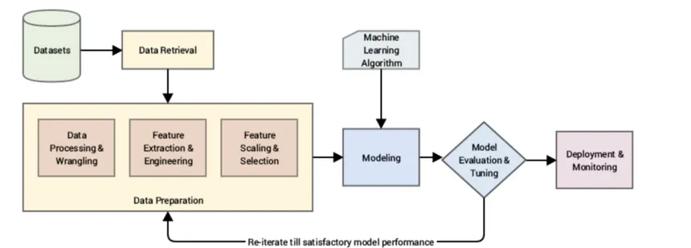
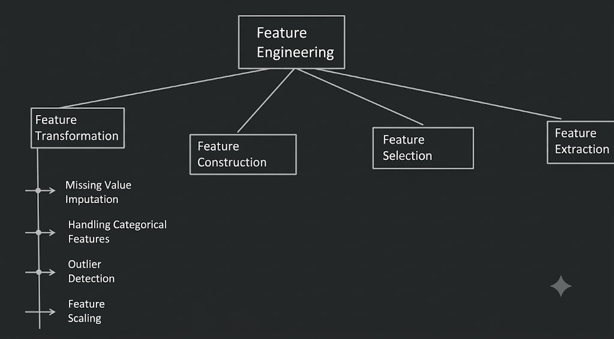
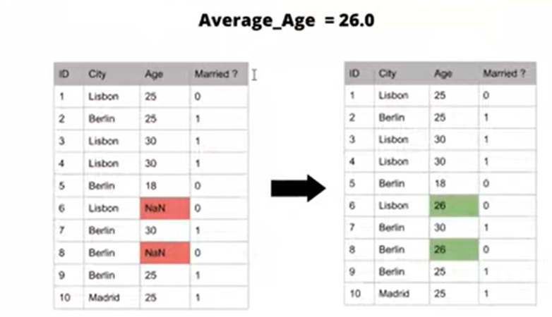
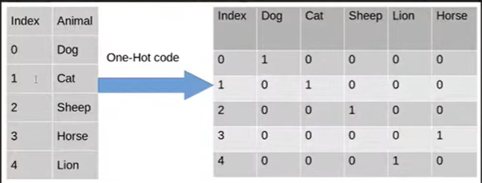
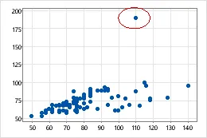
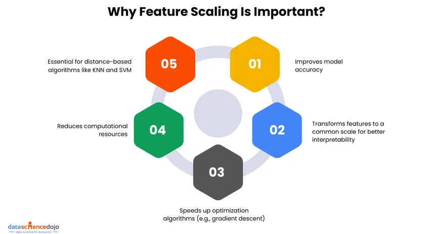
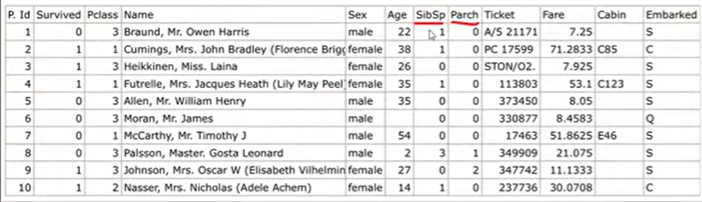
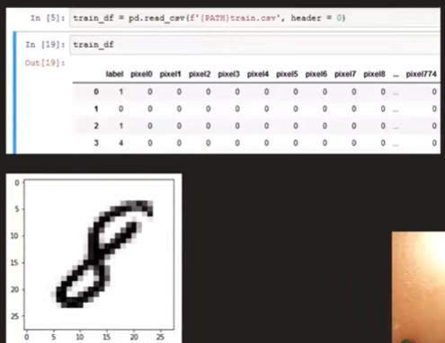
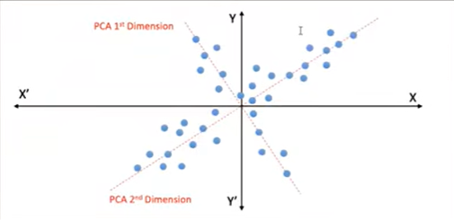

# Feature Engineering

## What is Feature Engineering?

**Feature Engineering** is the process of using **domain knowledge and data understanding to create, transform, select, or extract useful features from raw data**.

These features are then used to improve the performance of a Machine Learning model.

> Feature Engineering is often considered an **art**, as the process of creating useful features can differ from person to person depending on their understanding of the data and problem.



---

# Importance of Feature Engineering

Good features can significantly improve the performance of a Machine Learning model.

A popular idea in Machine Learning is:

> **A good feature-engineered dataset used with a simple model can sometimes perform better than a poorly prepared dataset used with a complex model.**

Therefore, understanding and preparing features properly is an important step before training a model.



---

# Common Feature Engineering Techniques

Feature Engineering mainly includes:

1. **Handling Missing Values**
2. **Handling Categorical Values**
3. **Outlier Detection and Handling**
4. **Feature Scaling**
5. **Feature Construction**
6. **Feature Selection**
7. **Feature Extraction**

---

# 1. Handling Missing Values

**Missing values** are data points that are not available in a dataset.

For example:

| Name | Age | Salary |
|------|-----|--------|
| John | 25 | 50000 |
| Sam | NaN | 60000 |
| Alex | 30 | NaN |

Missing values can affect the performance of Machine Learning models.



### Common Methods

- Remove rows containing missing values
- Replace numerical values with mean or median
- Replace categorical values with mode
- Use advanced imputation techniques

### Example

```python
df['Age'] = df['Age'].fillna(df['Age'].median())
```

---

# 2. Handling Categorical Values

**Categorical features** contain values that belong to specific categories.

### Examples

- Gender
- City
- Department
- Blood Group

Machine Learning models generally require numerical input. Therefore, categorical data needs to be converted into numerical form.



### Common Techniques

- Label Encoding
- One-Hot Encoding
- Ordinal Encoding

### Example: One-Hot Encoding

```python
pd.get_dummies(df, columns=['Gender'])
```

---

# 3. Outlier Detection and Handling

**Outliers** are unusual data points that are significantly different from other observations.

For example, if most people earn between ₹20,000 and ₹100,000 per month, a salary value of ₹10,000,000 may be considered an outlier.



### Common Methods for Detecting Outliers

- Box Plot
- IQR Method
- Z-Score
- Scatter Plot

### Example Using Box Plot

```python
sns.boxplot(x=df['Salary'])
```

Outliers can be:

- Removed
- Capped
- Transformed
- Kept if they represent valid information

---

# 4. Feature Scaling

**Feature Scaling** is the process of bringing numerical features to a similar range.

For example:

| Age | Salary |
|-----|--------|
| 25 | 50000 |
| 30 | 75000 |

Here, Salary has much larger values than Age.

Some Machine Learning algorithms are affected by differences in feature scales.



### Common Scaling Techniques

- Standardization
- Normalization

### Example: Standardization

```python
from sklearn.preprocessing import StandardScaler

scaler = StandardScaler()

df[['Age', 'Salary']] = scaler.fit_transform(
    df[['Age', 'Salary']]
)
```

---

# 5. Feature Construction

**Feature Construction** is the process of creating new features by combining or transforming existing features.



### Example: Titanic Dataset

The Titanic dataset contains:

- `SibSp` → Number of siblings or spouses
- `Parch` → Number of parents or children

We can combine these columns to create a new feature called **Family Size**.

```python
df['Family_Size'] = df['SibSp'] + df['Parch'] + 1
```

The `+1` represents the passenger themselves.

We can further classify passengers based on family size:

- `1` → Travelling Alone
- `2-4` → Small Family
- `5-8` → Big Family

### Example

```python
def family_type(size):
    if size == 1:
        return 'Alone'
    elif size <= 4:
        return 'Small'
    else:
        return 'Big'

df['Family_Type'] = df['Family_Size'].apply(family_type)
```

Creating meaningful features can help a Machine Learning model identify hidden patterns.

---

# 6. Feature Selection

**Feature Selection** is the process of selecting the most useful features from a dataset and removing unnecessary features.

A dataset may contain many features, but not every feature is useful for prediction.



### Example: MNIST Dataset

The popular **MNIST dataset** contains images represented using many pixel values as features.

Having too many features can:

- Increase model complexity
- Increase training time
- Cause overfitting
- Include irrelevant information

Feature Selection helps identify the most important features.

### Common Methods

- Correlation
- SelectKBest
- Recursive Feature Elimination (RFE)
- Feature Importance

### Example

```python
from sklearn.feature_selection import SelectKBest, f_classif

selector = SelectKBest(score_func=f_classif, k=10)

X_new = selector.fit_transform(X, y)
```

---

# 7. Feature Extraction

**Feature Extraction** is the process of transforming existing features into a new and more useful set of features.

Unlike Feature Selection, Feature Extraction creates new features from the existing data.



### Example: Real Estate Dataset

Suppose a dataset contains:

- Number of Rooms
- Size of Each Room
- Number of Bathrooms
- Size of Each Area

Instead of using every individual room-related feature separately, we can create a new feature such as:

**Total Carpet Area**

This can provide a more meaningful representation of the overall size of a house.

### Example

```python
df['Total_Area'] = (
    df['Living_Room_Area'] +
    df['Bedroom_Area'] +
    df['Kitchen_Area']
)
```

Feature Extraction helps reduce complexity while preserving important information.

---

# Feature Selection vs Feature Extraction

| Feature Selection | Feature Extraction |
|------------------|-------------------|
| Selects existing features | Creates new features |
| Removes unnecessary features | Transforms existing features |
| Original features remain unchanged | New features are generated |
| Example: Selecting important columns | Example: Creating Total Area |

---

# Quick Summary

| Technique | Purpose |
|-----------|---------|
| Missing Value Handling | Deals with missing data |
| Categorical Encoding | Converts categories into numbers |
| Outlier Handling | Detects unusual data points |
| Feature Scaling | Brings features to a similar scale |
| Feature Construction | Creates new features from existing data |
| Feature Selection | Selects the most useful features |
| Feature Extraction | Creates meaningful new features |

---

# Conclusion

**Feature Engineering** is an important part of the Machine Learning pipeline.

It helps transform raw data into meaningful features that can improve the performance of Machine Learning models.

Important Feature Engineering techniques include **handling missing values, encoding categorical data, detecting outliers, scaling features, constructing new features, selecting important features, and extracting useful information from existing data**.