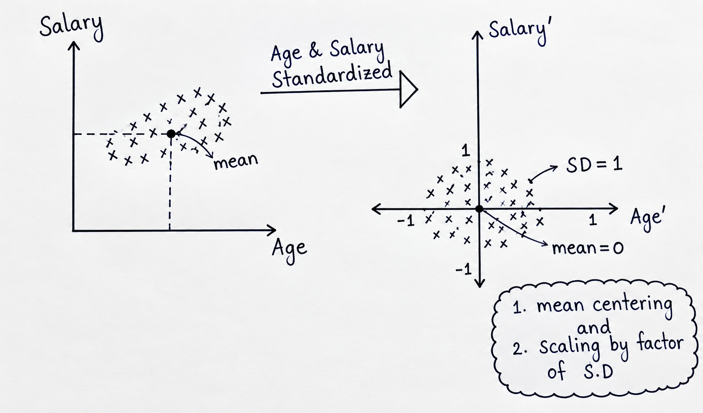
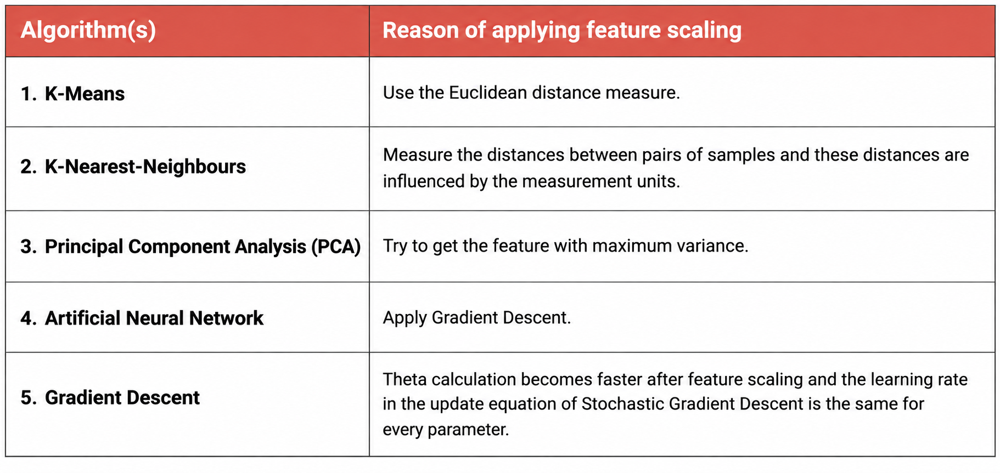

# Feature Scaling — Standardization

## What is Feature Scaling?

**Feature Scaling** is a preprocessing technique used to bring numerical features to a comparable scale.

It is especially important when features have very different ranges. For example:

- `Age` → values around 18–60
- `Salary` → values around 20,000–150,000

Without scaling, a feature with larger numerical values can have a greater influence on algorithms that depend on distance or gradient-based optimization.

---

## Types of Feature Scaling

Two commonly discussed approaches are:

1. **Standardization**
2. **Normalization**
   - Min-Max Scaling
   - Robust Scaling

In this section, we will focus on **Standardization**.

---

# Standardization

**Standardization** transforms a feature so that its values are centered around a mean of `0` and have a standard deviation of `1`.

The standardized value is calculated using:

$$
X_i' = \frac{X_i - \mu}{\sigma}
$$

Where:

- $X_i$ → Original value
- $\mu$ → Mean of the feature
- $\sigma$ → Standard deviation
- $X_i'$ → Standardized value


::contentReference[oaicite:0]{index=0}


### Example

Suppose we have an `Age` feature:

| Age |
|---:|
| 18 |
| 23 |
| 32 |
| 43 |
| 56 |
| 62 |
| 92 |

After applying standardization, a new feature can be created:

| Age | Standardized Age |
|---:|---:|
| 18 | $X_1'$ |
| 23 | $X_2'$ |
| 32 | $X_3'$ |
| 43 | $X_4'$ |
| 56 | $X_5'$ |
| 62 | $X_6'$ |
| 92 | $X_7'$ |

The standardized feature has approximately:

- **Mean ($\mu$) = 0**
- **Standard Deviation ($\sigma$) = 1**

> Standardization changes the **scale of the data**, not the relative ordering of the values.

---

# Geometric Intuition of Standardization

Before standardization, features can have very different scales.

For example:

- `Age` may range from 18–60
- `Salary` may range from 20,000–150,000

After standardization, both features are represented relative to their own mean and standard deviation.



### What happens?

Standardization involves two main steps:

1. **Mean Centering**  
   Subtract the mean from every value so that the data is centered around `0`.

2. **Scaling by Standard Deviation**  
   Divide by the standard deviation so that the feature has a standard deviation of `1`.

Therefore:

$$
X' = \frac{X-\mu}{\sigma}
$$

---

# Effect of Standardization

Standardization changes the numerical scale of the feature.

For example:

```text
Before:
Age → 18, 23, 32, 43, ...

After:
Age' → -1.2, -0.9, -0.4, 0.1, ...


The actual values change, but the **relationship and ordering between observations remain the same**.

---

# Standardization and Outliers

Standardization **does not solve the problem of outliers**.

This is because Standardization uses:

* Mean
* Standard deviation

Both can be affected by extreme values.

For example:

```text
18, 23, 32, 43, 56, 62, 92
```

If an extremely large value is added, the mean and standard deviation can change significantly, which affects the standardized values.

> If the dataset contains significant outliers, standardization alone should not be considered an outlier-handling technique.

---

# When Should We Use Standardization?

Standardization is particularly useful for algorithms where **feature magnitude affects the result**.

### Common examples

| Algorithm                      | Why Scaling Helps                                                             |
| ------------------------------ | ----------------------------------------------------------------------------- |
| **K-Means**                    | Uses Euclidean distance                                                       |
| **K-Nearest Neighbours (KNN)** | Distance between samples is affected by feature scale                         |
| **PCA**                        | Variance is used to determine important directions                            |
| **Artificial Neural Networks** | Gradient-based optimization benefits from appropriately scaled inputs         |
| **Gradient Descent**           | Scaling can make optimization faster and more stable                          |
| **Logistic Regression**        | Gradient-based optimization generally benefits from similarly scaled features |



---

# When Scaling Is Generally Not Required

Tree-based algorithms generally do not require feature scaling because their decisions are based on **feature thresholds**, rather than distances or gradient-based optimization.

Examples:

* **Decision Tree**
* **Random Forest**
* **Gradient Boosting**
* **XGBoost**

For example, a Decision Tree might learn:

```text
Age < 30
```

After standardization, it might instead learn an equivalent threshold:

```text
Age' < -0.5
```

The relative ordering of the values is preserved, so scaling usually does not provide a meaningful advantage.

---

# Standardization in Scikit-Learn

The `StandardScaler` from Scikit-Learn can be used to perform standardization.

The important workflow is:

```text
Training Data
     ↓
Fit StandardScaler
     ↓
Learn mean and standard deviation
     ↓
Transform Training Data
     ↓
Transform Test Data using the SAME scaler
```

### Important Rule

> **Fit the scaler only on the training data.**

Do not calculate scaling parameters separately from the test data.

```python
scaler.fit(X_train)

X_train_scaled = scaler.transform(X_train)
X_test_scaled = scaler.transform(X_test)
```

This prevents **data leakage** from the test set into the training process.

---

# Key Takeaways

* **Feature Scaling** brings numerical features to a comparable scale.

* **Standardization** centers data around `0` and scales it to a standard deviation of `1`.

* Formula:

  \(X' = \frac{X-\mu}{\sigma}\)

* Standardization uses the **mean and standard deviation**.

* It changes the scale but preserves the relative ordering of values.

* Standardization **does not remove or fix outliers**.

* It is useful for distance-based and many gradient-based algorithms.

* Tree-based algorithms such as **Decision Trees and Random Forests generally do not require scaling**.

* Always **fit the scaler on training data only**, then transform both training and test data using the same scaler.


