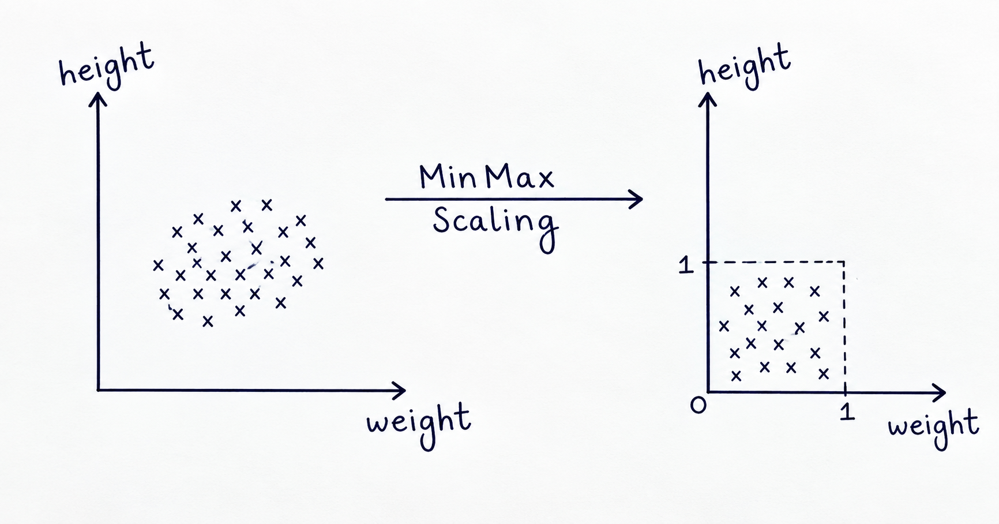

# Feature Scaling — Normalization

## What is Normalization?

**Normalization** is a feature scaling technique used to bring numerical features to a comparable scale without changing the relationship between their values.

It is useful when features have different ranges.

Example:

- `Age` → 18–60
- `Salary` → 20,000–150,000

---

## Types of Normalization

1. **Min-Max Scaling**
2. **Mean Normalization**
3. **Max Absolute Scaling**
4. **Robust Scaling**

---

## 1. Min-Max Scaling

**Min-Max Scaling** transforms values to a fixed range, usually **[0, 1]**.

### Formula

$$
X_i' = \frac{X_i - X_{min}}{X_{max} - X_{min}}
$$

Where:

- $X_i$ → Original value
- $X_{min}$ → Minimum value
- $X_{max}$ → Maximum value
- $X_i'$ → Scaled value

### Example

Suppose:

| Weight |
|---:|
| 130 |
| 67 |
| 81 |
| 61 |
| 32 |
| 54 |

After Min-Max Scaling:

$$
X' \in [0,1]
$$

- Minimum value → `0`
- Maximum value → `1`

### Geometric Intuition



For 2D data, Min-Max Scaling maps the data into a **square of side 1**.

For 3D data → **cube**

For higher dimensions → **hypercube**

### Key Points

- Range → **[0, 1]**
- Preserves relative relationships
- Sensitive to outliers
- Useful when a fixed range is required
- Commonly used for scaling inputs in **CNNs**

---

## 2. Mean Normalization

**Mean Normalization** centers the feature around its mean and scales it using the feature range.

### Formula

$$
X_i' = \frac{X_i - X_{mean}}{X_{max} - X_{min}}
$$

Where:

- $X_i$ → Original value
- $X_{mean}$ → Mean
- $X_{max}$ → Maximum value
- $X_{min}$ → Minimum value
- $X_i'$ → Normalized value

### Effect

- Value < Mean → **Negative**
- Value = Mean → **0**
- Value > Mean → **Positive**

The values are centered around `0`.

### Key Points

- Performs **mean centering**
- Similar to Standardization in terms of centering
- Rarely used
- No dedicated scaler in Scikit-Learn
- Standardization is usually preferred when centered data is required

---

## 3. Max Absolute Scaling

**Max Absolute Scaling** divides each value by the maximum absolute value of the feature.

### Formula

$$
X_i' = \frac{X_i}{|X|_{max}}
$$

### Example

```text
X = [-10, -5, 0, 5, 10]
```

Maximum absolute value:

```text
|X|max = 10
```

After scaling:

```text
[-1, -0.5, 0, 0.5, 1]
```

### Key Points

- Does **not** center the data
- `0` remains `0`
- Positive values remain positive
- Negative values remain negative
- Useful for **sparse data**
- Sensitive to outliers

### Sparse Data

Sparse data contains a large number of zero values.

Example:

```text
[0, 0, 0, 5, 0, 0, 10, 0]
```

Max Absolute Scaling preserves these zero values.

---

## 4. Robust Scaling

**Robust Scaling** uses the **median** and **Interquartile Range (IQR)** to scale the data.

### Formula

$$
X_i' = \frac{X_i - X_{median}}{IQR}
$$

### Interquartile Range

$$
IQR = Q_3 - Q_1
$$

Where:

- $Q_1$ → 25th percentile
- $Q_3$ → 75th percentile

Therefore:

$$
IQR = 75^{th}\ percentile - 25^{th}\ percentile
$$

### Why Robust?

Median and IQR are less affected by extreme values than mean and standard deviation.

Therefore, Robust Scaling is useful when the dataset contains **outliers**.

### Key Points

- Uses **Median**
- Uses **IQR**
- More resistant to outliers
- Useful for datasets with significant outliers

---

## Comparison of Normalization Techniques

| Technique | Formula | Main Idea | Outlier Effect |
|---|---|---|---|
| **Min-Max Scaling** | $\dfrac{X-X_{min}}{X_{max}-X_{min}}$ | Scale to [0, 1] | Sensitive |
| **Mean Normalization** | $\dfrac{X-X_{mean}}{X_{max}-X_{min}}$ | Center around mean | Sensitive |
| **Max Absolute Scaling** | $\dfrac{X}{\lvert X\rvert_{max}}$ | Scale by maximum absolute value | Sensitive |
| **Robust Scaling** | $\dfrac{X-X_{median}}{IQR}$ | Scale using median and IQR | More resistant |

---

## Normalization vs Standardization

| Feature | Normalization | Standardization |
|---|---|---|
| Main idea | Scale values to a comparable range | Center and scale data |
| Common techniques | Min-Max, Mean, Max Absolute, Robust | StandardScaler |
| Mean = 0 | Not always | Yes |
| S.D. = 1 | No | Yes |
| Fixed range | Depends on technique | No |
| Outlier handling | Depends on technique | Not resistant |
| Robust to outliers | Robust Scaling | No |

---

## Visualizing Normalization

Normalization can be visualized using:

- **Histogram / KDE** → Compare distributions
- **Boxplot** → Compare spread and outliers
- **Scatter Plot** → Compare relationships between features

The notebook compares the data **before and after scaling** using these visualizations.

---

## Important Rule

Fit the scaler **only on training data**.

```text
Training Data
      ↓
Fit Scaler
      ↓
Learn Scaling Parameters
      ↓
Transform Training Data
      ↓
Transform Test Data using the SAME Scaler
```

This prevents **data leakage**.

---

## Key Takeaways

- **Normalization** brings numerical features to a comparable scale.
- **Min-Max Scaling** → range `[0, 1]`.
- **Mean Normalization** → centers values around the mean.
- **Max Absolute Scaling** → useful for sparse data and preserves zeros.
- **Robust Scaling** → uses median and IQR and is more resistant to outliers.
- Min-Max, Mean, and Max Absolute Scaling are sensitive to outliers.
- Use **Robust Scaling** when outliers are significant.
- Fit the scaler on **training data only**.
- Use the same fitted scaler to transform both training and test data.